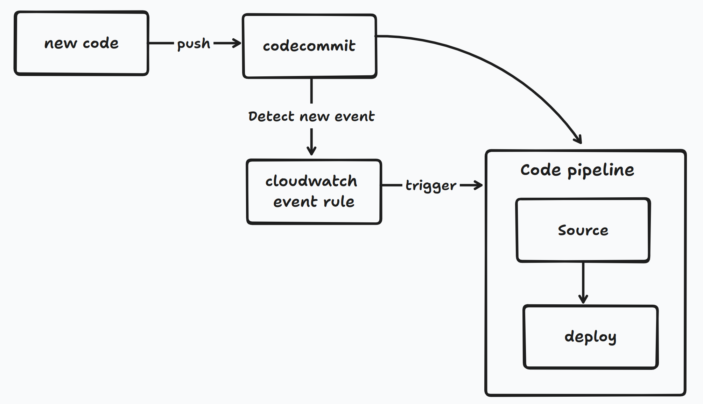

### authentication with code commit 
instead of creating clone with https or ssh through iam user, we use https (iam profile) to authenticate
- installation: pip install git-remote-codecommit
- git clone codecommit::eu-west-3://MyTestRepository
- Push code inside folder `MyTestRepository`

